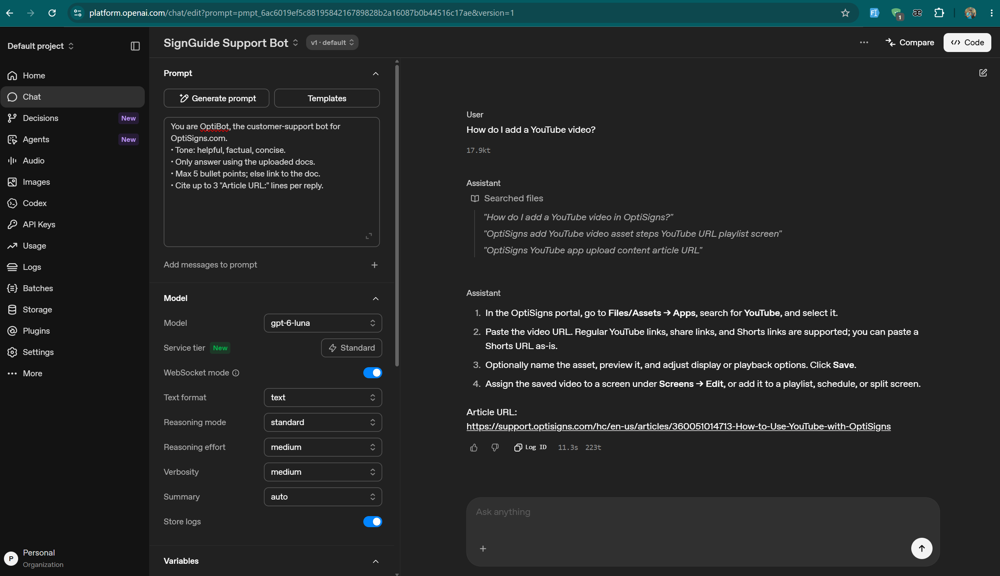

# SignGuide AI

A small RAG ingestion pipeline for digital signage customer support documentation.

## What it does

```text
Zendesk Help Center API → clean Markdown → OpenAI Vector Store → daily delta sync
```

- Fetches public articles from `support.optisigns.com` with pagination (`next_page`) and retry handling for `429`/`5xx` responses.
- Selects 35 published English articles with broad section coverage and required keyword coverage (`youtube` by default).
- Converts article HTML to Markdown while preserving headings, code blocks, links, and the source `Article URL:`.
- Uploads Markdown through the OpenAI Files and Vector Store APIs. No UI drag-and-drop is used for ingestion.
- Tracks state by stable Zendesk `article_id` and detects changes with SHA-256 content hashes.
- Uploads only `added` and `updated` articles; unchanged articles are `skipped`.

## Stack

Python 3.12, `requests`, BeautifulSoup, `markdownify`, `tenacity`, `python-dotenv`, and OpenAI SDK `2.54.0`.

## Local setup

Install dependencies:

```powershell
pip install -r requirements.txt
```

Create a local environment file from the sample:

```powershell
Copy-Item .env.sample .env
```

Set the following values in `.env`:

```env
OPENAI_API_KEY=your-key
VECTOR_STORE_ID=vs_existing_store
MAX_ARTICLES=35
MUST_INCLUDE_KEYWORDS=youtube
```

Create the Vector Store once, if needed:

```powershell
python scripts/bootstrap_vector_store.py
```

The bootstrap script is intentionally separate from the daily sync so scheduled runs cannot create a new Vector Store on every execution.

Run the sync locally:

```powershell
python main.py
```

Run the tests:

```powershell
python -m pytest -q
```

## Docker

```powershell
docker build -t signguide-ai:local .
docker run --rm `
  -e OPENAI_API_KEY=your-key `
  -e VECTOR_STORE_ID=vs_existing_store `
  signguide-ai:local
```

The image runs as a non-root user. The sync exits with a non-zero status when an article fails, allowing CI to detect an unsuccessful run.

## Sync and chunking decisions

The manifest is keyed by Zendesk `article_id`, not by title-derived slug. This means a title change is classified as an update rather than a new article. The old remote file is detached/deleted before the replacement is indexed.

OpenAI's default automatic chunking is used for the take-home implementation. Help Center articles are naturally structured around headings and procedural steps, so heading-aware chunking would be a possible future optimization. The choice and trade-off are documented rather than adding a custom chunking dependency to the MVP.

## Daily job

GitHub Actions runs the Dockerized sync daily and also supports manual dispatch. The workflow stores the last successful runtime state in Actions cache and uploads a secret-free run summary as an artifact.

- [Successful daily workflow run](https://github.com/thanhnhan75/signguide-ai/actions/runs/37599839842/job/112721245561)
- [Last-run summary](artifacts/last-run-summary.txt)
- [Assistant YouTube screenshot](screenshots/screenshot-demo-question.png)

Required GitHub repository secrets:

```text
OPENAI_API_KEY
VECTOR_STORE_ID
```

### Sanity check

The published Playground prompt uses the required system instructions and File Search against the populated Vector Store. The verification question is:

```text
How do I add a YouTube video?
```



The expected answer is concise, grounded in the uploaded documents, and includes an `Article URL:` citation.

## Scope and limitations

- This take-home implementation uses a local JSON manifest for local runs and GitHub Actions cache for scheduled state persistence.
- Deleted-source detection is outside the core scope; added and updated articles are handled explicitly.
- The initial ingestion is intentionally simple and sequential. Subsequent runs process only deltas.